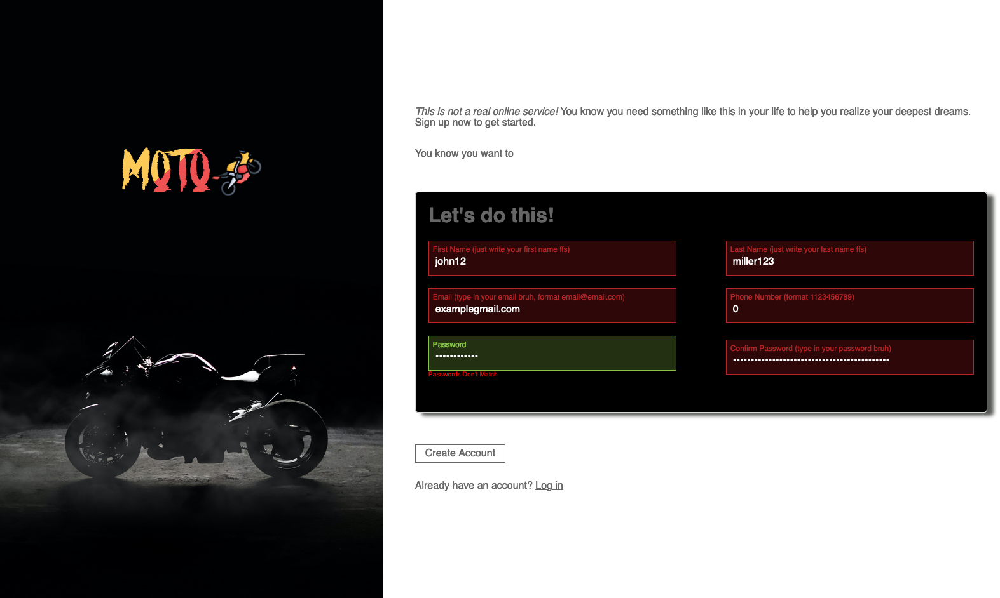

# Sign-Up-Form
This is a sign up form made using HTML and CSS.

## How to use
1. Visit the [Website](https://mosmn.github.io/Sign-Up-Form/)
2. Enter your details
3. Click on `Create Account`

## Screenshots

## Technologies Used

- HTML
- CSS

## Approach

I started by creating the basic HTML structure and then added the general styling to make it look consistent across different browsers. Then I added the styling for the form and the buttons. I used the `:focus` pseudo-class to style the input fields when they are focused. I also used the `:valid` pseudo-class to style the input fields when they are valid. I used the `:invalid` pseudo-class to style the input fields when they are invalid. I used the `:placeholder-shown` pseudo-class to style the input fields when they are empty. I used the `:required` pseudo-class to style the input fields when they are required. lastly, I used JavaScript to create a function that will check if the password and the confirm password fields match, and if they don't, it will display an error message and prevent the form from submitting.

## Challenges

The biggest challenge I faced was styling the form. I had to use a lot of pseudo-classes to style the form. I also had to use JavaScript to check if the password and the confirm password fields match.

## Future Improvements

- Add a password strength meter
- Add a password generator
- Add a Show/Hide password button

